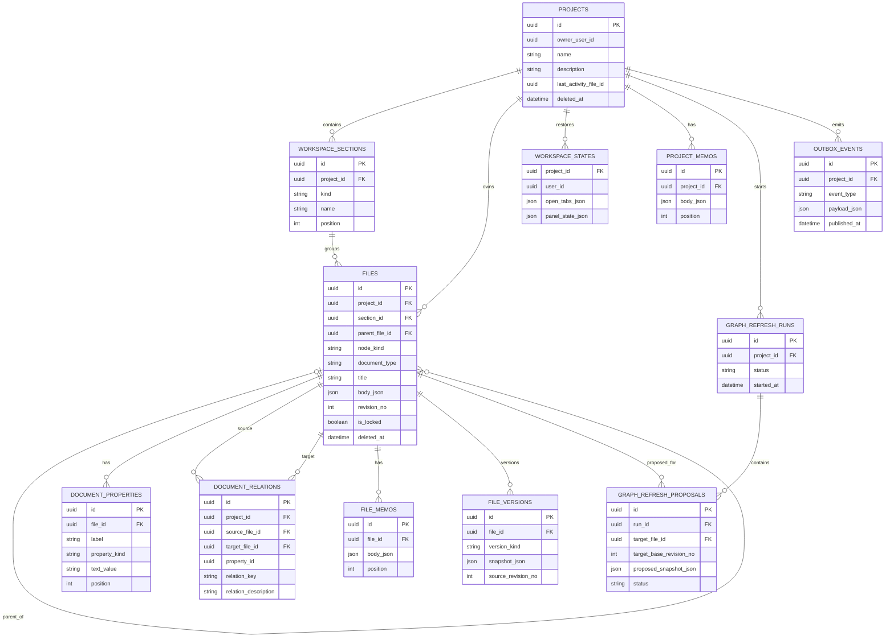
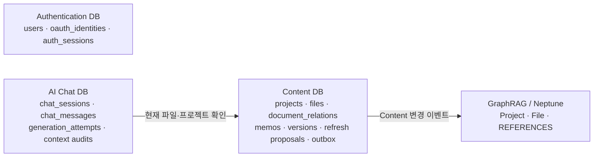

# Lore Sentry 핵심 테이블 ERD 초안

> 상태: 기능 요구사항을 기준으로 한 초기 설계안. 컬럼·세부 제약은 구현 전에 확정한다.

## 1. Content DB 핵심 ERD



## 2. 핵심 테이블의 역할

| 테이블 | 핵심 역할 |
|---|---|
| `projects` | 프로젝트 제목·선택 설명·최근 작업 정보·휴지통 상태 |
| `workspace_sections` | 기본 파일/즐겨찾기 영역과 사용자 생성 섹션 |
| `files` | 원고, 설정 문서, 에피소드 폴더 등 프로젝트 트리의 중심 엔터티 |
| `document_properties` | 설정 문서의 설명과 텍스트·참조 속성 행 |
| `document_relations` | 문서 관계의 정본. 그래프와 타임라인의 원천 |
| `project_memos` / `file_memos` | 프로젝트 메모와 파일별 복수 메모 |
| `file_versions` | 문서·속성·출발 관계를 함께 보관하는 비교·복원용 스냅샷 |
| `workspace_states` | 프로젝트 재진입 시 탭·편집 위치·패널·그래프 상태 복원 |
| `graph_refresh_runs` / `graph_refresh_proposals` | 원고를 근거로 설정 문서 변경안을 만들고 검토하는 작업 상태 |
| `outbox_events` | Content 변경을 GraphRAG에 안전하게 전달하는 발행 대기 이벤트 |

## 3. 관계 저장 원칙

관계는 `document_relations`에 한 번만 저장한다.

```text
도깨비 학살(A) ──관련 원고──> 3화 도깨비 학살(B)
도깨비 학살(A) ──관련 캐릭터──> 도깨비(C)
도깨비 학살(A) ──관련 장소──> 3809호차(D)
```

`B → A`를 자동으로 중복 저장하지 않는다. 대신 `source_file_id`와 `target_file_id` 양쪽에 인덱스를 둬, 출발 관계와 들어오는 관계를 모두 조회한다.

문서를 저장하면 Content DB가 문서·속성·관계·버전·Outbox를 하나의 트랜잭션으로 저장한다. Graph DB는 이 관계를 비동기로 투영할 뿐 원본은 아니다.

## 4. 서비스별 배치



- Content DB가 문서와 관계의 Source of Truth다.
- AI Chat 세션은 프로젝트에 속하고, 각 메시지 생성 때 현재 열린 파일을 맥락으로 기록한다.
- GraphRAG는 현재 활성 문서와 관계만 저장해 탐색·RAG에 사용한다.
- 서비스 간 ID는 값으로 전달하며, 서비스 DB를 가로지르는 외래 키는 만들지 않는다.

## 5. 의도적으로 지금 제외한 테이블

- 본문 안 명시적 문서 참조 테이블
- 이벤트별 별도 시간 항목 테이블
- Graph DB의 버전 스냅샷 테이블

타임라인은 별도 시간 항목이 아니라 원고와 설정 문서 사이의 `document_relations`를 기준으로 계산한다.

