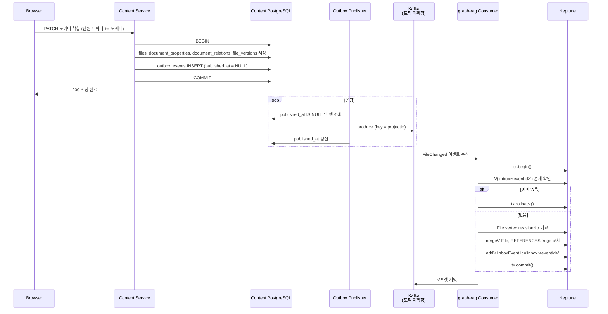

# Content → Neptune 동기화와 Inbox 패턴

> 갱신일: 2026-09-18  
> 목적: Content 서비스의 문서 변경이 GraphRAG의 Neptune 그래프에 반영되는 흐름을 한 가지 핵심 기능을 예로 들어 설명하고, 그 안에서 Outbox와 Inbox가 각각 어디에서 무엇을 보장하는지 정리한다.  
> 전제: [`LORE_SENTRY_PROJECT_CONTEXT.md`](LORE_SENTRY_PROJECT_CONTEXT.md) §4.4·§16.2·§19.3, [`TABLE_AND_LOGIC.md`](TABLE_AND_LOGIC.md) §4·§5

## 1. 한 줄 요약

Content PostgreSQL이 원본이고 Neptune은 투영본이다. Content는 **문서 변경과 Outbox 기록을 한 트랜잭션**으로 저장하고, graph-rag는 **Inbox 기록과 그래프 변경을 한 트랜잭션**으로 저장한다. 양쪽 모두 "기록"과 "실제 변경"을 분리하지 않는 것이 핵심이다.

```text
Content (PostgreSQL)                     graph-rag (Neptune)
┌──────────────────────────┐             ┌──────────────────────────┐
│ 문서·속성·관계 저장         │             │ Inbox 검사                │
│ + outbox_events INSERT    │ ─ Kafka ─▶  │ File vertex / edge 변경    │
│ = 트랜잭션 1개             │             │ + InboxEvent vertex 생성   │
└──────────────────────────┘             │ = 트랜잭션 1개             │
                                         └──────────────────────────┘
```

## 2. 예시로 쓰는 핵심 기능

[`CORE_FEATURE_REQUIREMENTS.md`](CORE_FEATURE_REQUIREMENTS.md) §5.2 설정 문서 편집과 §7.2 그래프를 예로 든다.

사용자가 이벤트 문서 **도깨비 학살**의 속성 표에서 `관련 캐릭터` 관계에 **도깨비** 칩을 추가한다. 별도 저장 버튼 없이 자동 저장된다. 잠시 뒤 그래프 화면을 열면 `도깨비 학살 → 도깨비` 간선이 보여야 한다.

이 기능이 요구하는 것은 다음과 같다.

- 자동 저장 응답은 Content DB 커밋으로 끝나야 하고, Neptune 반영을 기다리지 않는다 (§4.5 Gateway와 Kafka의 경계).
- Neptune 반영은 늦어도 되지만 **빠지거나 두 번 들어가면 안 된다.** 간선이 없거나 중복되면 그래프 화면이 틀린다.
- 사용자가 칩을 빠르게 넣었다 뺐다 하면 이벤트가 여러 개 생긴다. **마지막 상태가 이겨야 한다.**

## 3. 두 저장소의 모델 대응

| 개념 | Content PostgreSQL | Neptune |
|---|---|---|
| 파일 | `files` 행 | label `File`, id `file:<uuid>` |
| 프로젝트 | `projects` 행 | label `Project`, id `project:<uuid>` |
| 관계 | `document_relations` 행 | edge `REFERENCES`, `File → File` |
| 발행 대기 이벤트 | `outbox_events` 행 | 없음 (Neptune은 발행하지 않는다) |
| 처리 완료 이벤트 | 없음 | label `InboxEvent`, id `inbox:<eventId>` |

Neptune에는 테이블과 DDL이 없다. label이 테이블, vertex가 행, property가 컬럼, vertex id가 PK에 대응한다. **Neptune이 유일성을 보장하는 것은 vertex id와 edge id뿐**이므로, 중복을 막아야 하는 값은 property가 아니라 id에 넣는다. Inbox 키를 `inbox:<eventId>`라는 vertex id로 두는 이유다.

Neptune의 트랜잭션 단위는 다음과 같다.

| 방식 | 트랜잭션 |
|---|---|
| Gremlin sessionless 요청 | 요청 1개 = 트랜잭션 1개 |
| Gremlin 세션 + `g.tx()` | `begin()` ~ `commit()` 사이의 여러 traversal |
| openCypher HTTPS | 쿼리 1개 = 트랜잭션 1개 |
| openCypher Bolt | `beginTransaction()` ~ `commit()` 사이의 순차 쿼리 |

graph-rag는 Python이므로 `gremlinpython`의 `g.tx()`를 기준으로 설명한다.

## 4. 전체 플로우



### 4.1 Content 쪽 — Outbox

자동 저장 요청 하나가 PostgreSQL 트랜잭션 하나다. 문서·속성·관계·버전과 `outbox_events` 행이 함께 커밋되거나 함께 롤백된다. 그래서 "문서는 저장됐는데 이벤트가 없다"는 상태가 생기지 않는다.

Outbox publisher는 별도 워커다. `published_at IS NULL`인 행을 읽어 Kafka에 보내고 `published_at`을 찍는다. 보낸 뒤 `published_at` 갱신 전에 죽으면 같은 이벤트가 다시 발행된다. **Outbox는 at-least-once만 보장한다.** 이 중복을 받는 쪽에서 걸러내는 것이 Inbox의 역할이다.

### 4.2 이벤트 — 상태를 담는다

이벤트는 "칩이 추가됐다"는 변화가 아니라 **파일의 현재 상태와 출발 관계 전체**를 담는다. 이렇게 하면 소비 순서가 조금 꼬이거나 같은 이벤트가 두 번 와도 마지막 revision의 상태로 수렴한다.

```json
{
  "eventId": "8a1c…",
  "eventType": "FileChanged",
  "projectId": "p-1",
  "fileId": "f-A",
  "revisionNo": 42,
  "occurredAt": "2026-09-18T10:00:00Z",
  "file": {
    "title": "도깨비 학살",
    "documentType": "event",
    "deleted": false
  },
  "relations": [
    { "relationId": "r-1", "relationKey": "related_manuscript", "targetFileId": "f-B" },
    { "relationId": "r-2", "relationKey": "related_character",  "targetFileId": "f-C" },
    { "relationId": "r-3", "relationKey": "related_place",      "targetFileId": "f-D" }
  ]
}
```

토픽과 파티션 키는 아직 정하지 않았다 (§19.3). 이 문서는 **같은 프로젝트의 이벤트가 한 파티션에 순서대로 들어가고, 파티션당 컨슈머가 하나**라고 가정한다. 파티션 키를 projectId로 잡으면 이 가정이 성립한다. 다른 키를 고르면 4.3의 revision 가드가 순서 역전까지 흡수해야 하므로 설계를 다시 봐야 한다.

### 4.3 graph-rag 쪽 — Inbox

이벤트 하나를 처리하는 Neptune 트랜잭션은 다섯 단계다. 전부 한 `begin()` ~ `commit()` 안에 있다.

```text
begin
  1. V('inbox:8a1c…') 가 있는가?          → 있으면 rollback. 이미 처리한 이벤트다
  2. V('file:f-A').revisionNo >= 42 인가?  → 그렇다면 rollback. 더 새 상태가 이미 반영돼 있다
  3. mergeV File id='file:f-A'             → title, documentType, revisionNo=42 갱신
  4. V('file:f-A').outE('REFERENCES').drop()
     이벤트의 relations 마다 mergeE REFERENCES  → 출발 관계를 통째로 교체
  5. addV('InboxEvent').property(id, 'inbox:8a1c…')
commit
→ 커밋이 끝난 뒤에만 Kafka 오프셋 커밋
```

예시 이벤트를 반영하면 그래프는 다음과 같아진다.

```text
(file:f-A 도깨비 학살) ─REFERENCES related_manuscript─▶ (file:f-B 3화 도깨비 학살)
(file:f-A 도깨비 학살) ─REFERENCES related_character─▶  (file:f-C 도깨비)
(file:f-A 도깨비 학살) ─REFERENCES related_place─▶      (file:f-D 3809호차)
(inbox:8a1c…)   label InboxEvent, projectId p-1, processedAt …
```

gremlinpython으로 쓰면 다음 형태다.

```python
def apply_file_changed(g, evt):
    inbox_id = f"inbox:{evt['eventId']}"
    file_id = f"file:{evt['fileId']}"

    tx = g.tx()
    gtx = tx.begin()
    try:
        if gtx.V(inbox_id).has_next():
            tx.rollback()
            return "duplicate"

        if gtx.V(file_id).has("revisionNo", P.gte(evt["revisionNo"])).has_next():
            tx.rollback()
            return "stale"

        (gtx.merge_v({T.id: file_id})
            .option(Merge.on_create, {T.label: "File", "projectId": evt["projectId"]})
            .property("title", evt["file"]["title"])
            .property("documentType", evt["file"]["documentType"])
            .property("revisionNo", evt["revisionNo"])
            .iterate())

        gtx.V(file_id).out_e("REFERENCES").drop().iterate()
        for rel in evt["relations"]:
            (gtx.merge_e({T.id: f"rel:{rel['relationId']}"})
                .option(Merge.on_create, {
                    T.label: "REFERENCES",
                    Direction.OUT: file_id,
                    Direction.IN: f"file:{rel['targetFileId']}",
                })
                .property("relationKey", rel["relationKey"])
                .iterate())

        (gtx.add_v("InboxEvent")
            .property(T.id, inbox_id)
            .property("projectId", evt["projectId"])
            .property("processedAt", evt["occurredAt"])
            .iterate())

        tx.commit()
        return "applied"
    except Exception:
        if tx.is_open():
            tx.rollback()
        raise
```

`property(id, …)`의 `id`는 일반 property 키가 아니라 `T.id`, 즉 vertex id 자체를 지정하는 키워드다. `property('id', …)`처럼 따옴표를 붙이면 유일성이 없는 일반 property가 되어 Inbox가 동작하지 않는다.

## 5. 장애 시나리오별 결과

| 상황 | 결과 | 막아 주는 것 |
|---|---|---|
| Content DB 커밋 전에 죽음 | 문서도 Outbox도 없음. 사용자가 재시도 | PostgreSQL 트랜잭션 |
| Outbox publisher가 Kafka 전송 후 `published_at` 갱신 전에 죽음 | 같은 이벤트 두 번 발행 | Inbox 1단계에서 두 번째를 버림 |
| graph-rag가 Neptune 커밋 전에 죽음 | 아무것도 남지 않음. Kafka가 재전송 | Neptune 트랜잭션 |
| graph-rag가 Neptune 커밋 후 오프셋 커밋 전에 죽음 | 재전송된 이벤트가 옴 | Inbox 1단계에서 버림 |
| 사용자가 칩을 넣었다 빼서 revision 41, 42 이벤트가 연달아 옴 | 42가 먼저 반영됐다면 41은 버림 | 2단계 revision 가드 |
| 파일 삭제 뒤 늦은 갱신 이벤트 | 삭제 이벤트가 revision을 올려 두므로 갱신은 stale로 버림 | 2단계 revision 가드 |
| 같은 이벤트를 두 컨슈머가 동시에 처리 (리밸런스 경계) | 한쪽만 커밋, 다른 쪽은 `ConcurrentModificationException` | Neptune 범위 락. 예외는 백오프 후 재시도하면 1단계에서 걸러짐 |

RDB Inbox와 다른 점이 하나 있다. 그래프 투영은 upsert이므로 두 번 반영해도 결과가 같을 때가 많다. 그래도 Inbox를 두는 이유는 (1) 오프셋 커밋 전 재전송을 싸게 걸러내고, (2) revision 가드와 함께 삭제 뒤 부활을 막고, (3) 어떤 이벤트가 언제 반영됐는지 추적하기 위해서다.

## 6. 남은 결정

- **토픽과 파티션 키.** 어떤 이벤트를 어떤 토픽으로 보낼지, 파티션 키를 무엇으로 할지 미확정이다. 4.2의 순서 가정은 이 결정에 달려 있다.
- **삭제 이벤트.** `deleted: true`일 때 vertex를 `drop()`할지, `deleted` property만 세워 두고 조회에서 제외할지. 후자여야 늦은 갱신 이벤트가 revision 가드에 걸린다.
- **대상 vertex 부재.** 관계 대상 파일(`f-C`)의 이벤트가 아직 안 왔을 수 있다. `mergeE`는 양 끝 vertex가 있어야 하므로 대상도 `mergeV`로 placeholder를 만들지 정한다.
- **InboxEvent 정리.** Neptune에는 TTL이 없다. `processedAt` 기준 며칠 지난 `InboxEvent`를 주기적으로 `drop()`한다. 파티션당 단일 컨슈머이므로 보관 기간은 짧아도 된다.
- **드라이버.** graph-rag는 현재 `httpx`뿐이다. Gremlin이면 `gremlinpython`, openCypher면 `neo4j` Bolt 드라이버를 추가한다.
- **DLQ.** 5단계까지 갔는데 계속 실패하는 이벤트(스키마 불일치 등)를 어디로 보낼지.
